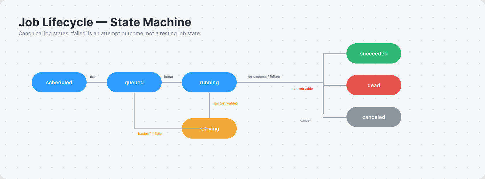
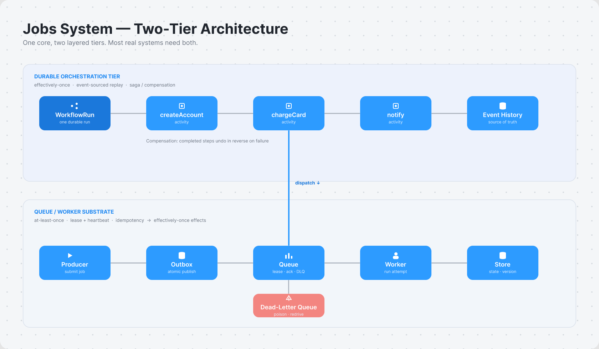
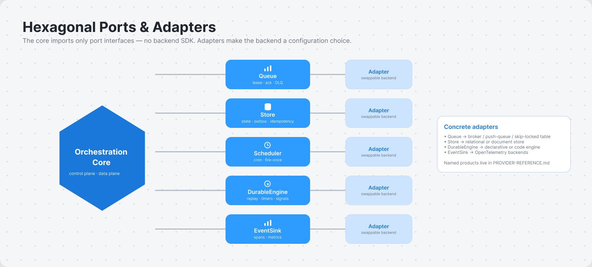
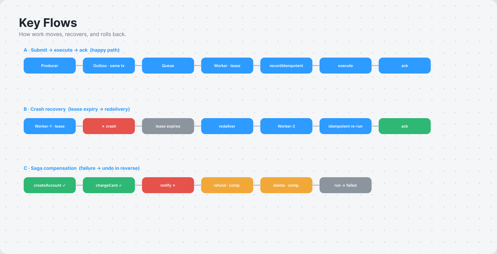
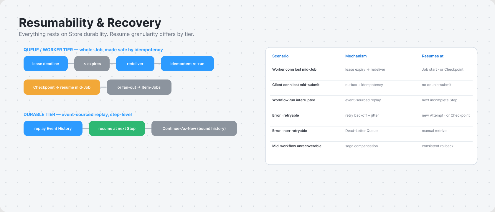

# Jobs System — Definitive Reference Architecture

**Status:** Reference architecture — vendor- and language-agnostic.
**Audience:** Engineers building or evaluating a portable job-orchestration system.
**Scope:** The abstract model, component boundaries, contracts, cross-cutting concerns (security, capacity, testing), and the rationale behind each choice. This document names **no commercial products**: it states the patterns and invariants that any conforming implementation must satisfy. Concrete products that satisfy these patterns — and how they map onto the ports below — live in the companion `PROVIDER-REFERENCE.md`. Implementation is out of scope; §15 marks the hooks where a future buildable spec attaches.

It relies only on **open, vendor-neutral standards** where a concrete interop format is unavoidable (CloudEvents, JSON Schema, AsyncAPI, OpenAPI, OpenTelemetry, W3C Trace Context, Serverless Workflow, BPMN). Everything else is described as a pattern, not a tool.

**Terminology:** all terms, states, and naming in this document follow `GLOSSARY.md` (the normative gold standard). On any conflict, the glossary wins.

---

## Table of Contents

1. Goals & Non-Goals
2. Core Model
3. Hexagonal Decomposition (Ports & Adapters)
4. Port Interface Contracts
5. Message Contract
6. Pattern Mandates
7. Delivery & Consistency Semantics
8. Key Flows
9. Security & Multi-Tenancy
10. Capacity & Scaling Model
11. Observability Contract
12. Failure Taxonomy
13. Testing & Verification Strategy
14. Resumability & Recovery
15. Implementation Hooks (out of scope here)
- Appendix A — Architecture Decision Records
- Appendix B — Glossary
- Appendix C — Source Map (neutral sources)

---

## 1. Goals & Non-Goals

### Goals

- **Generic across backends.** One core model that maps onto any queue, store, scheduler, or durable engine without rewriting orchestration logic.
- **Generic across languages.** The *contract*, not the code, is the portability boundary. Clients in any language interoperate through a shared message schema and shared lifecycle semantics.
- **Hardened.** Crash-safe long-running work, effectively-once *effects*, explicit failure handling (§12), and a real security model (§9) are first-class.
- **Scalable.** Control plane and data plane separate so workers scale independently of orchestration state (§10).
- **Definitive & defensible.** Every major choice is recorded as a decision with its rationale and rejected alternatives (Appendix A).
- **A reference, not a product.** The deliverable is a model others implement. It defines *what* must hold, not *which tool* provides it.

### Non-Goals

- **No code, no library, no concrete API** in this document. Concrete types attach at the hooks in §15.
- **No new durable-execution engine.** We define the *port* a durable engine must satisfy, not an implementation.
- **No low-code/visual builder** and **no stream-processing engine.** A job system *invokes* such systems; it is not one. Their internals (watermarks, checkpointing) are mined for patterns only.
- **No product naming.** Mappings onto real products are intentionally external (`PROVIDER-REFERENCE.md`) so the core stays clean.

### YAGNI boundaries

Priority queues, weighted fairness, and tenant quotas are acknowledged but specified only to the depth of "the `Queue` port may carry a priority hint." Full fair-share batch scheduling is deferred.

---

## 2. Core Model

### 2.1 Job lifecycle state machine

A **job** is a unit of work with a durable identity and a single owning state. Every backend must represent this machine, even if it names the states differently.

```
                  ┌────────────┐
   submit ───────▶│  scheduled │  (delay / cron / future-dated)
                  └─────┬──────┘
                        │ due
                        ▼
                  ┌────────────┐      lease/claim     ┌────────────┐
   submit ───────▶│   queued   │────────────────────▶│  running   │
                  └─────┬──────┘                      └─────┬──────┘
                        ▲                                   │
            retry (backoff+jitter)                          │
                        │                 ┌─────────────────┼─────────────────┐
                  ┌─────┴──────┐          │                 │                 │
                  │  retrying  │◀── fail (retryable) ────────┘                 │
                  └────────────┘                                               │
                        │ retries exhausted                                    │
                        ▼                                                       ▼
                  ┌────────────┐                                         ┌────────────┐
                  │    dead    │◀── fail (non-retryable / poison)        │ succeeded  │
                  └────────────┘                                         └────────────┘

   cancel ─────▶ (from scheduled | queued | running | retrying) ──▶ ┌───────────┐
                                                                    │ canceled  │
                                                                    └───────────┘
```

Canonical **job** states: `scheduled`, `queued`, `running`, `retrying`, `succeeded`, `dead`, `canceled`. (`failed` is an **attempt** outcome, not a resting job state — see `GLOSSARY.md` §3.)

- A failed *attempt* moves the *job* to `retrying` (budget remaining) or `dead` (poison / exhausted).
- `dead` ⇒ the message lands in a Dead-Letter Queue for triage.
- `canceled` is reachable from any non-terminal state and must propagate (§7.3).



### 2.2 Two tiers



The system is **two layered tiers**, and the central architectural claim is that *most real systems need both*:

| Tier | Responsibility | Delivery guarantee | When it owns the work |
|---|---|---|---|
| **Queue / Worker substrate** (lower) | Move a single job from producer to a worker; lease, ack, retry, DLQ. | At-least-once | Single-step jobs; the transport beneath everything. |
| **Durable Orchestration** (upper) | Coordinate multi-step, long-running, crash-safe workflows; saga/compensation; fan-out/fan-in. | Effectively-once via event-sourced replay | Anything with steps, waits, branches, or compensation. |

A "fire one job" request lives entirely in the lower tier. A "provision → bill → notify → on failure roll back" flow lives in the upper tier and *uses* the lower tier to dispatch each step. (ADR-001.)

### 2.3 Why layered (not durable-only, not queue-only)

- **Not durable-only:** forcing an event-sourced workflow onto a trivial single-shot job is overhead, and not every backend provides a durable engine — the adapter would have to *emulate* one, a leak.
- **Not queue-only:** punts the hard problem the system exists to solve — surviving a crash mid-workflow with correct compensation.

The layered model lets each job sit at the lowest tier that satisfies it. (ADR-001.)

---

## 3. Hexagonal Decomposition (Ports & Adapters)

The core is backend-agnostic; all backend specifics live behind **ports**. This is ports-and-adapters (hexagonal) architecture. (ADR-002.)



### 3.1 Control plane vs data plane

- **Control plane:** submit/cancel/query jobs, define workflows, manage schedules, read history. Low-throughput, consistency-sensitive.
- **Data plane:** dispatch, lease, execute, ack, retry. High-throughput, availability-sensitive.

They scale and fail independently. **A control-plane outage must not stop in-flight workers from completing and acking** — a hard invariant tested in §13.

### 3.2 The ports

Each port is a narrow interface the core depends on; each backend supplies an adapter. A reader should understand a port without reading any adapter, and an adapter should be swappable without touching the core.

| Port | Purpose | Core depends on it for | Hidden behind it |
|---|---|---|---|
| **`Queue`** | Enqueue / lease / ack / nack / dead-letter a message. Optional priority + delay hints. | Lower-tier delivery. | Visibility timeout, ack protocol, redrive policy. |
| **`Store`** | Durable persistence of job + workflow state, history, idempotency records, outbox. | State transitions, dedup, outbox. | Relational vs document model, transaction semantics, skip-locked row claiming. |
| **`Scheduler` / `Clock`** | Fire jobs at a future time or on a cron; one-shot leader-elected ticks. | `scheduled` state, recurring jobs, timeouts. | Distributed cron, fan-out dedupe, time-wheel internals. |
| **`DurableEngine`** | Run a multi-step workflow with crash-safe replay, timers, signals, child workflows. | Upper-tier orchestration & saga. | Event sourcing, deterministic replay, history storage. |
| **`EventSink`** | Emit lifecycle + telemetry events (state changes, spans, metrics). | Observability contract (§11). | Telemetry exporter, log backend, metrics system. |

**Design rule:** core orchestration logic imports only these port interfaces. No core file references a backend SDK. This is what makes the mappings in `PROVIDER-REFERENCE.md` a configuration choice rather than a fork.

### 3.3 Pattern → port binding

| Pattern (§6) | Binds to |
|---|---|
| Idempotency keys (§6.1) | `Store`, `Queue` |
| Outbox / inbox (§6.2) | `Store`, `Queue` |
| Saga / compensation (§6.3) | `DurableEngine` |
| DLQ + poison (§6.4) | `Queue`, `EventSink` |
| Retry + backoff + jitter (§6.5) | `Queue`, `Scheduler` |
| Visibility timeout / lease / heartbeat (§6.6) | `Queue` |
| Circuit breaker / bulkhead / backpressure (§6.7) | worker runtime, `Queue` depth |

---

## 4. Port Interface Contracts

The §3.2 table names the ports; this section pins their **semantics** — operations, inputs/outputs, pre/post-conditions, and invariants every adapter must honor. Signatures use language-neutral pseudotype notation (`Name(args) -> result`). They are contracts, not code; an adapter in any language satisfies the same contract with its own idioms (ADR-009).

Conventions: `JobRef` = opaque durable job id; `Lease` = `{ jobRef, token, deadline }`; `Result<T>` = success-or-typed-error; times are explicit, never read from a wall clock inside the durable tier (§7.2).

### 4.1 `Queue`

```
enqueue(msg: CloudEvent, opts: { delay?, priority?, dedupKey? }) -> Result<JobRef>
lease(maxItems, leaseDuration) -> Result<List<Lease + CloudEvent>>
heartbeat(lease: Lease, extendBy) -> Result<Lease>        // renew before deadline
ack(lease: Lease) -> Result<void>                          // success; remove from queue
nack(lease: Lease, retryAfter?) -> Result<void>            // failure; re-deliver later
deadLetter(lease: Lease, reason) -> Result<void>           // give up; move to DLQ
depth() -> Result<{ ready, inflight, delayed, dead }>       // for §10 autoscaling
```

- **Pre:** `enqueue` requires a schema-valid `msg` (§5.2). `ack`/`nack`/`heartbeat`/`deadLetter` require an unexpired `lease`.
- **Post:** after `ack`, the message is never re-delivered. After `nack`/lease-expiry, it is re-delivered **at least once**.
- **Invariant — single active lease:** at most one live lease per message at a time (visibility timeout, §6.6). A `heartbeat` past `deadline` fails; the message is already re-leasable.
- **Invariant — at-least-once:** the port never guarantees exactly-once delivery; dedup is the consumer's job (§4.2, §6.1).

### 4.2 `Store`

```
saveState(jobRef, state, expectedVersion) -> Result<version>   // optimistic concurrency
loadState(jobRef) -> Result<{ state, version, history }>
recordIdempotent(key, jobRef, resultRef) -> Result<Committed | AlreadyExists>
appendOutbox(tx, msg) -> Result<void>                          // same tx as business write
readOutbox(batch) -> Result<List<msg>>; markOutboxSent(ids) -> Result<void>
```

- **Pre:** `saveState` requires `expectedVersion`; a mismatch returns a conflict (no lost updates).
- **Post — idempotency:** `recordIdempotent` is the dedup primitive. First writer for a `key` gets `Committed`; any later writer gets `AlreadyExists` and must return the prior `resultRef` without re-running effects (§6.1).
- **Invariant — outbox atomicity:** `appendOutbox` participates in the *same* transaction as the caller's state write. Either both commit or neither (§6.2). Stores lacking multi-row transactions satisfy this via single-document or conditional write.

### 4.3 `Scheduler` / `Clock`

```
scheduleAt(jobRef, when) -> Result<void>
scheduleCron(defId, cronExpr, tz) -> Result<ScheduleRef>
cancelSchedule(ref) -> Result<void>
onDue(callback)                                  // fires due jobs exactly once per occurrence
```

- **Invariant — fire-once:** each cron occurrence dispatches **once** cluster-wide, even with many scheduler replicas (leader election / dedupe, ADR-006). A missed tick is detectable, never silently dropped.
- **Pre:** `cronExpr` is in the one canonical grammar; adapters translate to backend dialects.

### 4.4 `DurableEngine`

```
startWorkflow(defId, input, idempotencyKey) -> Result<WorkflowRun>
signal(ref, name, payload) -> Result<void>
query(ref, name) -> Result<view>                 // read-only, side-effect-free
cancel(ref, reason) -> Result<void>              // propagates to children + activities
// inside a workflow definition:
executeActivity(name, input, retryPolicy, timeouts) -> Result<output>
startTimer(duration); awaitSignal(name); startChild(defId, input)
```

- **Invariant — determinism:** workflow code must be deterministic and replayable. No wall-clock reads, un-seeded randomness, or direct I/O in the workflow body — all side effects go through `executeActivity`. The engine recovers by replaying history (§7.2). Verified by replay tests (§13.2).
- **Invariant — idempotent start:** `startWorkflow` with a previously seen `idempotencyKey` returns the existing `WorkflowRun`, never a duplicate run.
- **Post — cancellation:** `cancel` propagates to child workflows and in-flight activities and triggers compensations for completed saga steps (§6.3, §7.3).

### 4.5 `EventSink`

```
emitLifecycle(jobRef, fromState, toState, attrs)
startSpan(name, traceContext) -> Span; endSpan(span, status)
recordMetric(name, value, labels)
```

- **Invariant — non-blocking:** emission must not block or fail job execution. A dead sink degrades observability, never correctness (buffer/drop, never deadlock).
- **Invariant — trace continuity:** every hop links into one trace via propagated context (§11.1).

---

## 5. Message Contract (the portability boundary)

Portability lives in the **wire format and semantics**, not shared code. A producer in one language and a worker in another interoperate because they agree on the envelope. This is the one place a concrete format is unavoidable, so the choices here are open, vendor-neutral standards.

### 5.1 Envelope — CloudEvents

The job message is a **CloudEvents** event — a vendor-neutral specification with bindings for any common transport (ADR-003).

| Attribute | Role |
|---|---|
| `id` | Unique event id. |
| `source` | Producer identity. |
| `type` | Job/event type — routes to a handler or workflow. |
| `time` | Emit timestamp. |
| `datacontenttype` | Payload media type (default `application/json`). |
| `data` | The job payload (validated, §5.2). |
| **`idempotencykey`** (extension) | Caller-supplied dedup key — the single most important field in the system (§6.1). |
| **`traceparent` / `tracestate`** (extension) | W3C Trace Context for cross-hop spans (§11). |
| **`tenantid`** (extension) | Tenant scope for isolation and authz (§9). |

The four custom fields are CloudEvents **extension** attributes, not core attributes.

### 5.2 Payload validation — JSON Schema

`data` is validated against a per-`type` **JSON Schema** at the boundary (on submit *and* on consume). An invalid payload is a non-retryable failure → straight to `dead`; it will never become valid by retrying (§12).

### 5.3 Channel description — AsyncAPI / OpenAPI

Queues/topics and their message types are described with **AsyncAPI**, documenting the async surface the way **OpenAPI** documents the sync control-plane API. **Serverless Workflow** and **BPMN** are recognized vendor-neutral workflow-definition standards, but neither is mandated — the `DurableEngine` port abstracts the workflow-definition format so any engine (declarative or code-based) conforms (ADR-008).

---

## 6. Pattern Mandates

These patterns are **required** of any conforming implementation, each bound to specific ports (§3.3).

### 6.1 Idempotency keys — mandatory

The linchpin of correctness. Every job carries an `idempotencykey` (§5.1). The consumer records processed keys via `Store.recordIdempotent` (§4.2); a duplicate delivery (inevitable under at-least-once) is detected and the prior result returned without re-running side effects. This converts at-least-once transport into effectively-once *effects* (§7.1). (ADR-004.)

### 6.2 Outbox / Inbox — transactional messaging

A job must not be "committed to the database" and "published to the queue" in two non-atomic steps. The producer writes the message to an **outbox** in the *same* `Store` transaction as its business state; a relay publishes from the outbox. The consumer's **inbox** is the idempotency record from §6.1.

### 6.3 Saga — orchestration over choreography

Multi-step workflows spanning resources use the **saga** pattern for consistency without distributed transactions. The reference favors **orchestration** sagas (a central `DurableEngine` workflow drives steps and runs compensations on failure) over choreography, keeping failure/compensation logic in one auditable place. Each forward step declares a compensating action. (ADR-005.)

### 6.4 Dead Letter Queue + poison handling

After the retry budget is exhausted, or on a non-retryable failure, the message moves to a DLQ with full context (original message, attempt history, last error). DLQ growth is a first-class alert (§11.3).

### 6.5 Retry with exponential backoff + jitter

Retryable failures re-enqueue with exponentially increasing delay plus **jitter** (preventing retry storms / thundering herd). A bounded retry budget separates `retrying` from `dead`.

### 6.6 Visibility timeout / lease / heartbeat

A claimed job is invisible to other workers for a lease period. Long-running work **renews the lease via heartbeat**; a crashed worker's lease expires and the job is redelivered. This is the lower-tier crash-recovery mechanism (§8.2).

### 6.7 Stability patterns — circuit breaker, bulkhead, backpressure, rate limiting

A worker calling a failing dependency trips a **circuit breaker**; resource pools are **bulkheaded** so one job type cannot starve others; producers respect **backpressure** when queue depth grows (§10.2); token-bucket **rate limiting** caps throughput to protect downstreams.

---

## 7. Delivery & Consistency Semantics

### 7.1 Effectively-once

The system targets **at-least-once delivery + idempotent consumers ⇒ effectively-once effects**. True end-to-end exactly-once is not assumed from any transport. The contract: transports may deliver more than once; consumers make duplicates harmless (§6.1). Even where a log-based transport provides exactly-once *within its own boundary*, that guarantee does not extend to external side effects — crossing into a non-idempotent external system still requires an idempotency key. At-most-once (may drop) is an explicit opt-in for telemetry-grade work only. (ADR-004.)

### 7.2 Determinism & replay (upper tier)

A `DurableEngine` workflow recovers by **replaying its event history**. Workflow code must therefore be **deterministic**: no wall-clock reads, no un-seeded randomness, no direct I/O in the workflow body — all side effects go through recorded activities. This is a hard constraint the port imposes on every durable adapter (§4.4); replay-safe logging is part of it.

### 7.3 Cancellation & timeout propagation

Cancellation and timeouts propagate **down the workflow tree**: canceling a parent cancels its children and in-flight activities and runs compensations for completed steps. Timeouts exist at three scopes — schedule-to-start, start-to-close (per attempt), and overall workflow — each independently configurable.

---

## 8. Key Flows

Sequence sketches for the load-bearing flows. `P`=Producer, `Q`=Queue, `St`=Store, `W`=Worker, `DE`=DurableEngine, `ES`=EventSink.



### 8.1 Submit → execute → ack (lower tier, happy path)

```
P → St : begin tx
P → St : write business state + appendOutbox(msg)        ┐ atomic (§6.2)
P → St : commit tx                                       ┘
relay → St : readOutbox → Q : enqueue(msg)               (state: queued)
W → Q  : lease(n, leaseDur)                              (state: running)
W → St : recordIdempotent(key) → Committed               (first time)
W      : execute side effects
W → St : saveState(succeeded, version)
W → ES : emitLifecycle(running→succeeded)
W → Q  : ack(lease)                                      (removed; never redelivered)
```

Duplicate delivery: the second `recordIdempotent(key)` returns `AlreadyExists`; the worker skips effects, returns the prior result, and acks (§6.1).

### 8.2 Crash recovery (lease expiry)

```
W1 → Q : lease(msg)          deadline=T+30s
W1     : ... crashes at T+10s (no ack, no heartbeat)
   Q   : at T+30s lease expires → msg re-leasable
W2 → Q : lease(msg)          (redelivered, at-least-once)
W2 → St: recordIdempotent(key)
         ├─ AlreadyExists + effects applied → ack (no double-effect)
         └─ not present / effects partial → idempotent re-execute
```

The lease (§6.6) — not a heartbeat from a healthy worker — is what makes worker death safe.

### 8.3 Saga with compensation (upper tier)

```
DE: startWorkflow(provision, idempotencyKey)
DE → activity: createAccount      ok
DE → activity: chargeCard         ok
DE → activity: sendWelcome        FAIL (non-retryable)
DE: run compensations in reverse:
    refundCard        (compensate chargeCard)
    deleteAccount     (compensate createAccount)
DE: workflow → failed; history retained for audit
```

Each forward step's compensation is declared up-front (§6.3). A crash *between* any two steps resumes via replay (§7.2), not restart.

### 8.4 Cancellation propagation

```
client → DE : cancel(workflowRun, reason)
DE → child workflows   : cancel (recursive)
DE → in-flight activity: cancel signal (cooperative)
DE → completed steps   : run compensations (§6.3)
DE → ES : emitLifecycle(* → canceled)
```

---

## 9. Security & Multi-Tenancy

"Hardened" is unsupported without an explicit security model. Each port carries a security responsibility; isolation is enforced end-to-end on `tenantid` (§5.1).

### 9.1 Authentication & authorization

- **Transport:** service-to-service traffic is mutually authenticated (mutual TLS or an equivalent signed-identity mechanism), with internal (node-to-node) and external (client-facing) channels independently configurable.
- **Control-plane authz:** submit/cancel/query are authorized per principal and per tenant. A policy gate enforces who may act on which job types.
- **Workflow-level authz:** the durable tier scopes callers to a namespace/tenant boundary.

### 9.2 Data protection

- **In transit:** TLS on every hop.
- **At rest:** queue, store, and workflow history are encrypted at rest with managed keys.
- **Payload-level (end-to-end):** sensitive `data` may be encrypted by the producer and decrypted only by authorized workers — opaque to the broker and the orchestration engine. A pluggable **payload codec** at the message boundary implements this, protecting payloads even from the platform operator.
- **Claim-check:** large or sensitive payloads are stored out-of-band; the message carries a reference, not the body. This doubles as a payload-size mitigation (§10.4).

### 9.3 Least privilege

Every port adapter runs with the **minimum** permissions its role requires — never wildcards. Wildcard resource/verb grants silently widen as new resources appear; conforming deployments grant specific resources and specific verbs. A worker that consumes queue *A* and writes store *B* gets exactly those grants and nothing else.

### 9.4 Multi-tenant isolation

- `tenantid` rides in every envelope and scopes all `Store` reads/writes and authz checks.
- Isolation strength is a deployment choice on a spectrum: shared queues with tenant-scoped authz (cheapest) → per-tenant queues/namespaces → fully separate deployments (strongest). The model supports all three; the adapter chooses.
- **Noisy-neighbor** containment uses bulkheads and rate limits (§6.7, §10.2) so one tenant's backlog cannot starve another.

---

## 10. Capacity & Scaling Model

Control plane and data plane scale independently (§3.1). The data plane scales on **queue signals**, not host CPU alone.

### 10.1 Worker autoscaling on queue depth

Worker concurrency tracks queue backlog, not host metrics. The reference signal is **ready depth ÷ target-per-worker** (`Queue.depth()`, §4.1). An event-driven autoscaler scales worker replicas from this signal and may scale to zero between bursts. The same signal drives serverless concurrency targets.

### 10.2 Backpressure

When `depth.ready` grows faster than throughput drains it, producers must slow (token-bucket admission, §6.7) rather than enqueue unboundedly. Unbounded queues convert a transient slowdown into an insurmountable backlog the system cannot drain. Backpressure plus DLQ-for-poison keep the queue head moving.

### 10.3 Concurrency & fairness

- **Per-job-type concurrency caps** (bulkheads) prevent one type from consuming all workers.
- **Lease tuning:** lease duration ≈ p99 processing time + heartbeat margin. Too short → spurious redelivery; too long → slow crash recovery (§8.2).
- Priority/weighted fairness is acknowledged but deferred (§1 YAGNI).

### 10.4 Runtime caps & long work

Ephemeral/serverless compute has cold-start latency and hard max-runtime caps. Therefore:

- **Long workflows checkpoint, never hold a process.** The durable tier persists progress and resumes (§7.2), so wall-clock workflow length is decoupled from any single compute invocation's lifetime.
- **Large payloads use claim-check** (§9.2) to stay under broker message-size limits.
- Burst behavior: autoscalers typically react only after load is *sustained* (seconds-to-minutes), so provision a warm floor for latency-critical paths.

---

## 11. Observability Contract

Async work is invisible without deliberate instrumentation; observability is part of the contract. It is built on open telemetry standards, not a specific backend.

### 11.1 Tracing — OpenTelemetry across hops

Every job carries **W3C Trace Context** (`traceparent`/`tracestate`) in its envelope (§5.1). Each hop — submit, enqueue, lease, execute, each workflow step — is an **OpenTelemetry span**, linked into one trace via the propagated context (`EventSink.startSpan`, §4.5). This is the only way to follow one logical job across producer, broker, worker, and child workflows. Messaging semantic conventions are followed so spans are portable across backends.

### 11.2 Metrics — required signals

Every conforming system exposes: **queue depth / backlog**, **processing latency** and **queue-wait latency** (separately), **throughput**, **success/failure rate**, **retry rate**, and **DLQ size & growth rate**.

### 11.3 SLI / SLO catalog for async work

| SLI | Example SLO |
|---|---|
| Queue-wait latency (p99) | < N seconds (set per workload) |
| Processing success rate | > 99.9% over 30 days |
| DLQ growth | 0 sustained growth (any sustained growth pages) |
| Stuck/zombie jobs | 0 jobs running beyond max-runtime |

Error-budget framing governs alerting. Standard alerts: backlog over threshold, DLQ growth, stuck/zombie jobs (lease expired but not redelivered).

### 11.4 Operator UI

The monitoring surface is specified as a **6-screen reference**: overview/health, queue/backlog, job detail + history, workflow/DAG view, DLQ triage, schedules. (Concrete dashboards that realize these screens are catalogued in `PROVIDER-REFERENCE.md`.)

---

## 12. Failure Taxonomy

Every failure is classified, because the class determines the handling.

| Class | Examples | Handling |
|---|---|---|
| **Transient** | Network blip, throttling, dependency 503, lease lost. | Retry with backoff+jitter (§6.5); counts against retry budget. |
| **Permanent / non-retryable** | Schema-invalid payload, auth denied, business-rule violation. | No retry → `dead` immediately; DLQ with reason. |
| **Poison** | Message that repeatedly crashes the worker. | Bounded attempts then `dead`; isolate so it cannot block the queue head. |
| **Partial / mid-workflow** | Crash after step 2 of 4. | Durable replay resumes; on unrecoverable step, run compensations (§6.3). |
| **Infrastructure** | Backend outage, store unavailable. | Backpressure + circuit-break; control-plane outage must not fail in-flight data-plane work (§3.1). |

The discriminator — a payload-validation failure must not be retried, a throttling failure must — is encoded so the retry path never burns budget on permanent failures.

---

## 13. Testing & Verification Strategy

A definitive architecture states how conformance is *proven*.

### 13.1 Port contract tests

Each port (§4) ships a **shared contract-test suite** that every adapter must pass — one suite, many adapters. The suite asserts the invariants: single-active-lease, at-least-once redelivery, outbox atomicity, idempotent-start. This is what makes "swap the adapter" safe (§3).

### 13.2 Determinism / replay tests (durable tier)

Workflow definitions are tested by **replaying recorded histories** and asserting identical decisions — the standard durable-execution test for non-determinism regressions. A **time-skipping** test harness fast-forwards timers and long sleeps so a multi-day workflow tests in milliseconds. Any wall-clock/random/I/O leak into workflow code (§7.2) fails replay.

### 13.3 Chaos & failure injection

Resilience claims (lease recovery §8.2, backpressure §10.2, control-plane independence §3.1) are validated by **deliberately injecting failures**: kill workers mid-lease, drop the store, throttle the queue. A fault-injection layer simulates backend errors and latency so resilience is tested without touching production.

### 13.4 Local-parity integration tests

A full local backend runs the entire stack so end-to-end flows (§8) are tested with zero infrastructure cost. Local emulation covers backend-specific adapter behavior.

---

## 14. Resumability & Recovery

This section consolidates the recovery guarantees defined across §6–§8 and specifies how work resumes after a crash, disconnect, or error — by tier and granularity. Everything here rests on **`Store` durability**: state, `Event History`, idempotency records, outbox, and checkpoints must survive the failure to be recovered from.



### 14.1 Recovery primitives

| Primitive | Defined in | Recovers from |
|---|---|---|
| Lease + heartbeat + visibility window | §6.6, §8.2 | dead / disconnected worker → redelivery |
| Event-sourced replay (`Event History`) | §7.2, §8.3 | interrupted `WorkflowRun` → resume at next incomplete `Step` |
| Idempotency keys | §7.1 | makes redelivery / replay safe (no double effects) |
| Outbox (atomic write + publish) | §7.2 | producer crash mid-submit |
| Retry + backoff + jitter | §7.5 | transient error → new `Attempt` |
| DLQ + redrive | §7.4 | non-retryable error → parked, manually resumable |
| Saga compensation | §8.3 | unrecoverable mid-workflow → consistent rollback |

### 14.2 Resume granularity by tier

- **Workflow tier — step-level.** A `WorkflowRun` replays its `Event History` and resumes at the next incomplete `Step`; completed steps' results are read from history, not re-executed (§7.2).
- **Job tier — whole-Job by default.** A redelivered `Job` re-runs from the start of its body; idempotency (§7.1) prevents double *effects*, but the work itself restarts. For a `Job` processing many `Item`s this means reprocessing from the first `Item` — addressed by §14.3.

### 14.3 Mid-Job resumability (tiered)

A `Job` that processes many `Item`s resumes by one of two strategies, in preference order:

1. **Default — fan-out to Item-Jobs.** When `Item`s are independent, model the item-set as a `Batch` of one-`Job`-per-`Item` (or per shard). Resumability then falls out of the existing job-tier machinery: only the incomplete Item-Jobs are redelivered, tracked by `Batch` counters. No new primitive; maximal parallelism. This mirrors indexed-completion and distributed-map designs.
2. **Escape hatch — Chunk-commit `Checkpoint`.** When a `Job` must process the stream as one unit (shared in-Job context, ordering, or fan-out too costly), the worker persists a **`Checkpoint`** — the last committed `Chunk` cursor plus an optional opaque payload — to the `Store` at each `Chunk` commit, and propagates it on the **lease heartbeat** (§6.6). On redelivery, the new `Attempt` reads the last `Checkpoint` and resumes from it. Granularity is tuned by `Chunk` size: smaller chunks = less rework on failure, more commit overhead — the universal checkpoint-interval tradeoff.

**Non-solution.** Progress *reporting* (a percent-complete telemetry signal) is **not** a `Checkpoint`. A resume point must be durably committed to the `Store` and read back by the next `Attempt`; never resume from a reporting value. (ADR-011.)

### 14.4 Workflow-tier history bounding — Continue-As-New

Long-running or eternal `WorkflowRun`s bound their `Event History` (and thus replay cost and storage) via **Continue-As-New**: the run ends and a fresh one starts with the same workflow id and carried-forward state. In-flight steps are not auto-carried — drain or re-issue them explicitly.

### 14.5 Recovery semantics by scenario

| Scenario | Mechanism | Resumes at |
|---|---|---|
| Worker connection lost mid-Job | lease expiry → redelivery (§8.2) | Job start — or last `Checkpoint` (§14.3) |
| Client connection lost mid-submit | outbox + idempotency (§7.2, §7.1) | no double-submit |
| `WorkflowRun` interrupted | event-sourced replay (§7.2) | next incomplete `Step` |
| Error, retryable | retry backoff (§7.5) | new `Attempt` — or last `Checkpoint` |
| Error, non-retryable | DLQ (§7.4) | manual redrive after fix |
| Mid-workflow unrecoverable | saga compensation (§8.3) | consistent rollback |

---

## 15. Implementation Hooks (out of scope here)

Implementation is deliberately deferred. When a buildable spec is written, it attaches at these hooks — none decided here:

- **Lead language** and its idioms. The contracts (§4) are language-neutral by design (ADR-009).
- **First backend pair** — a full-fidelity, zero-cost local stack is the recommended starting point before any hosted backend.
- **Concrete port types** — turning §4's pseudotype contracts into real signatures in the chosen language.
- **Reference-impl validation** — studying mature engines' internals to confirm the abstractions survive production before committing them (see `PROVIDER-REFERENCE.md`).

A buildable spec gets its own spec → plan → implementation cycle.

---

## Appendix A — Architecture Decision Records

Each ADR: the decision, why, and what was rejected. Stated without product names; concrete instantiations live in `PROVIDER-REFERENCE.md`.

- **ADR-001 — Two layered tiers (queue substrate + durable orchestration).** *Why:* most real systems need both cheap single-shot dispatch and crash-safe multi-step workflows; one tier alone either adds overhead to trivial jobs or punts crash-safety. *Rejected:* durable-only (overhead + forces emulation on backends without a durable engine); queue-only (no crash-safe workflows). (§2)
- **ADR-002 — Hexagonal ports & adapters as the structure.** *Why:* the only way to stay generic across backends without forking the core. *Rejected:* per-backend codebases; a thick common runtime that re-implements each backend's engine. (§3)
- **ADR-003 — CloudEvents as the wire envelope.** *Why:* a vendor-neutral standard with bindings for any target transport; makes the contract (not code) the portability boundary. *Rejected:* per-library native payloads (locks language); a bespoke envelope (no ecosystem, no bindings). (§5)
- **ADR-004 — Effectively-once via at-least-once + idempotent consumers.** *Why:* no transport guarantees end-to-end exactly-once across external side effects; idempotency is the universal primitive. *Rejected:* assuming exactly-once delivery; at-most-once as default (silent data loss). (§6.1, §7.1)
- **ADR-005 — Orchestration sagas over choreography.** *Why:* keeps failure/compensation logic in one auditable place; easier to reason about and test. *Rejected:* choreography (compensation logic smeared across services, hard to audit). (§6.3)
- **ADR-006 — Distributed cron fires once cluster-wide.** *Why:* duplicate scheduled fires cause duplicate work; leader election / dedupe makes occurrences exactly-once at the scheduler. *Rejected:* per-replica timers (N fires per occurrence). (§4.3)
- **ADR-007 — Local backend is first-class, not a stub.** *Why:* full-fidelity local parity enables zero-cost iteration and honest integration tests. *Rejected:* in-memory-only local mode (hides real failure modes). (§13.4)
- **ADR-008 — Workflow-definition format hidden behind the `DurableEngine` port.** *Why:* declarative-DSL and code-based engines are irreconcilable as a single surface; the port abstracts them. *Rejected:* mandating one workflow DSL — would exclude engines that don't speak it. (§5.3)
- **ADR-009 — Contracts stay language-neutral.** *Why:* portability across languages is a core goal; pinning a language in the contract defeats it. *Rejected:* specifying ports in one language's types. (§4, §15)
- **ADR-010 — Payload-level (end-to-end) encryption is supported, not just transport/at-rest.** *Why:* protects sensitive payloads even from the platform operator; required for some compliance regimes. *Rejected:* relying solely on transport/at-rest encryption. (§9.2)
- **ADR-011 — Tiered mid-Job resumability: fan-out by default, Chunk-commit `Checkpoint` as escape hatch.** *Why:* independent item-sets resume for free via job-tier redelivery when fanned out to Item-Jobs (no new machinery); unitary streaming jobs need a durable cursor, best carried on the existing lease heartbeat to reuse primitives we already own. *Rejected:* periodic global snapshots (heavyweight, stream-engine-oriented — overkill for discrete jobs); treating progress *reporting* as a resume point (not durably committed → incorrect resume); a single uniform mechanism (forces checkpoint machinery onto the common independent-item case that doesn't need it). (§14)

---

## Appendix B — Glossary

The glossary moved to `GLOSSARY.md`, the normative naming gold standard. It defines every domain term (`Job`, `Worker`, `Lease`, `Workflow`, `WorkflowRun`, `Step`, `Activity`, `Compensation`, `Outbox`, `DeadLetter`, …), the canonical state vocabulary (§3), and the structural naming conventions (§1) this document obeys. Do not redefine terms here — add or change them in `GLOSSARY.md` so all docs stay consistent.

---

## Appendix C — Source Map (neutral sources)

This document's claims rest on vendor-neutral standards and pattern literature. Product-specific evidence is mapped in `PROVIDER-REFERENCE.md`.

| Section | Neutral source basis (`docs/`) |
|---|---|
| Ports / hexagonal | `docs/17-gap-fill/{hexagonal,strangler-fig}` |
| Message contract | `docs/13-specs/{cloudevents,asyncapi,json-schema,openapi,serverless-workflow,bpmn}` |
| Patterns (idempotency, outbox, saga, DLQ, retry) | `docs/patterns/microservices-io`, `docs/17-gap-fill/{idempotent-consumer,eip-claim-check}` |
| Delivery semantics / theory | `docs/16-education` |
| Observability (OpenTelemetry semantic conventions) | `docs/17-gap-fill/otel-semconv`, `docs/12-observability` |
| Failure taxonomy | `docs/17-gap-fill/failure-taxonomy` |

Companion: `PROVIDER-REFERENCE.md` (product mappings, positioning, vendor evidence). Knowledge graph: `.graphify/GRAPH_REPORT.md`.
