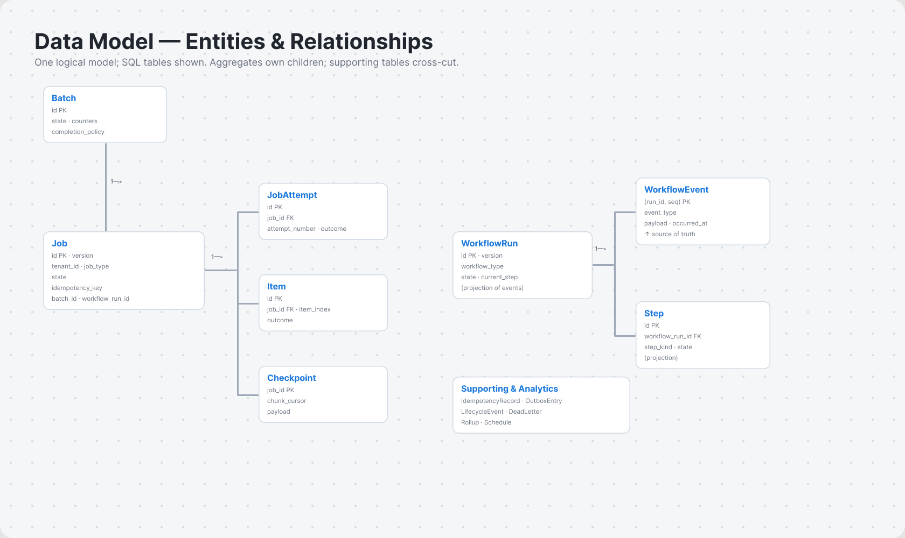

# Jobs System — Data Strategy

**Status:** Normative companion to `ARCHITECTURE.md`. Concretizes the **`Store`** port (`ARCHITECTURE.md` §3.2, §4.2) into a data model.
**Scope:** the logical data model and **two** physical realizations — a **relational (SQL)** schema and a **document (NoSQL)** schema — plus history, analytics, retention, and cross-cutting concerns. Product-free: "relational store" and "document store" are paradigms, not named products (mappings live in `PROVIDER-REFERENCE.md`).
**Terminology & locale:** every entity, field, and state value follows `GLOSSARY.md` (gold standard); en-US throughout. SQL identifiers are snake_case; wire/JSON fields camelCase; state/enum values lowercase snake_case; timestamps `<verbed>_at` (SQL) / `<verbed>At` (wire), RFC 3339 UTC.

---

## Table of Contents

1. Design Decisions (DDRs)
2. Logical Model
3. SQL Realization
4. NoSQL Realization
5. Access-Pattern Catalog
6. History & Event Model
7. Analytics
8. Retention, Archival, Partitioning
9. Cross-Cutting (tenancy, idempotency, outbox, concurrency)
10. Trade-offs — SQL vs NoSQL per access pattern

---

## 1. Design Decisions (DDRs)

- **DDR-001 — One logical model, two physical realizations.** A single logical model (§2); the SQL and NoSQL schemas are parallel realizations of the same `Store` port. Either backs the whole system. *Rejected:* polyglot-by-default (operational complexity), SQL-only (excludes extreme-scale deployments).
- **DDR-002 — Hybrid history.** Job/Batch tier = current-state record **+** append-only `LifecycleEvent` log. Workflow tier = **event-sourced**: `WorkflowEvent` is the source of truth, `WorkflowRun`/`Step` are projections (matches replay, `ARCHITECTURE.md` §7.2). *Rejected:* fully event-sourced (heavy read path for simple jobs); state-only (loses workflow replay).
- **DDR-003 — Document-per-aggregate with the event stream as an item collection.** In NoSQL, each aggregate is one document; unbounded child streams (`WorkflowEvent`, optionally `Item`) are stored as item-collection children keyed under the aggregate, not embedded. *Rejected:* embedding unbounded arrays (document-size limits, hot-document contention).
- **DDR-004 — `Item` rows are optional; the `Checkpoint` cursor is the default.** Mid-`Job` resume uses a `Checkpoint` cursor (`ARCHITECTURE.md` §14.3); per-`Item` rows are persisted only when per-item outcome tracking or partial-failure replay is required. *Rejected:* always persisting every `Item` (write amplification for large item-sets).
- **DDR-005 — Analytics = `LifecycleEvent` → rollups + OLAP export.** Operational rollups are projected from `LifecycleEvent`s; an `Outbox`/CDC `Export Feed` ships the same events to an external OLAP star schema (§7). *Rejected:* ad-hoc queries on the operational store at scale (load risk).
- **DDR-006 — Optimistic concurrency via a `version` field.** Every mutable aggregate carries a monotonic `version`; writes assert the expected version (`Store.saveState`, §4.2). *Rejected:* pessimistic locking (throughput cost), last-write-wins (lost updates).

---

## 2. Logical Model



### 2.1 Entities

Aggregates and supporting entities (all from `GLOSSARY.md`). "Tier" per `ARCHITECTURE.md` §2.2.

| Entity | Kind | Mutability | Tier |
|---|---|---|---|
| `Job` | aggregate | current-state + `version` | lower |
| `JobAttempt` | child of Job | append-only | lower |
| `Item` | child of Job (optional) | mutable outcome | lower |
| `Checkpoint` | child of Job (one current) | upsert | lower |
| `Batch` | aggregate | current-state + counters | lower |
| `WorkflowRun` | aggregate | **projection** | upper |
| `WorkflowEvent` | child of WorkflowRun | **append-only (source of truth)** | upper |
| `Step` | child of WorkflowRun | **projection** | upper |
| `Schedule` | aggregate | current-state | both |
| `IdempotencyRecord` | supporting | write-once + status | cross |
| `OutboxEntry` | supporting | write-once + sent flag | cross |
| `LifecycleEvent` | supporting | append-only | cross |
| `DeadLetter` | supporting | write-once + redrive | cross |
| `Rollup` | analytics | upsert/increment | analytics |

### 2.2 Containment (mirrors `GLOSSARY.md` §2.0)

```
WorkflowRun ──< WorkflowEvent (source of truth)   ──projects──> Step
     │ dispatches
Batch ──────< Job ──< JobAttempt
                 ├──< Item        (optional)
                 └──  Checkpoint   (one current)
Schedule ── emits ──> Job | WorkflowRun
Job / Batch ──< LifecycleEvent ──> Rollup ──> Export Feed (OLAP)
```

### 2.3 Identity & references

- Every aggregate has a bare `id` (opaque, sortable — e.g. a time-ordered unique id).
- References use `<entity>_id` (SQL) / `<entity>Id` (wire).
- Every row/document carries `tenant_id` (§9.1).
- Large payloads are stored out-of-band (claim-check, `ARCHITECTURE.md` §9.2); the record holds a `*_ref`, not the body.

---

## 3. SQL Realization

Normalized relational schema. Generic SQL (vendor-neutral types: `TEXT`, `TIMESTAMP` = "with time zone, UTC", `JSON`, `BIGINT`, `BOOLEAN`). State columns constrained to the canonical vocabulary.

### 3.1 Core aggregates

```sql
CREATE TABLE job (
  id              TEXT PRIMARY KEY,
  tenant_id       TEXT NOT NULL,
  job_type        TEXT NOT NULL,
  state           TEXT NOT NULL
                  CHECK (state IN ('scheduled','queued','running','retrying','succeeded','dead','canceled')),
  version         BIGINT NOT NULL DEFAULT 0,
  idempotency_key TEXT,
  priority        INTEGER NOT NULL DEFAULT 0,
  payload_ref     TEXT,
  batch_id        TEXT REFERENCES batch(id),
  workflow_run_id TEXT REFERENCES workflow_run(id),
  schedule_id     TEXT REFERENCES schedule(id),
  scheduled_at    TIMESTAMP,
  attempt_count   INTEGER NOT NULL DEFAULT 0,
  max_attempts    INTEGER NOT NULL DEFAULT 1,
  lease_token     TEXT,
  lease_deadline  TIMESTAMP,
  leased_by       TEXT,
  last_error_class  TEXT
                    CHECK (last_error_class IN ('transient','permanent','poison','partial','infrastructure')),
  last_error_detail TEXT,
  result_ref      TEXT,
  created_at      TIMESTAMP NOT NULL,
  updated_at      TIMESTAMP NOT NULL,
  started_at      TIMESTAMP,
  finished_at     TIMESTAMP,
  UNIQUE (tenant_id, idempotency_key)
);

-- dispatch / claim (the hot path): canonical lease-claim query
--   SELECT * FROM job
--   WHERE tenant_id = ? AND state = 'queued' AND scheduled_at <= now()
--   ORDER BY priority DESC, scheduled_at
--   FOR UPDATE SKIP LOCKED            -- SQL:2016; skip-locked row claiming
--   LIMIT ?;
CREATE INDEX job_dispatch  ON job (tenant_id, state, scheduled_at, priority);
CREATE INDEX job_by_batch  ON job (batch_id);
CREATE INDEX job_by_wf     ON job (workflow_run_id);
CREATE INDEX job_zombie    ON job (state, lease_deadline);   -- stuck/zombie detection (§11.3)
```

```sql
CREATE TABLE job_attempt (         -- append-only; retry history
  id            TEXT PRIMARY KEY,
  job_id        TEXT NOT NULL REFERENCES job(id),
  tenant_id     TEXT NOT NULL,
  attempt_number INTEGER NOT NULL,
  worker_id     TEXT,
  outcome       TEXT CHECK (outcome IN ('succeeded','failed')),   -- null while running
  error_class   TEXT,
  error_detail  TEXT,
  started_at    TIMESTAMP NOT NULL,
  finished_at   TIMESTAMP,
  duration_ms   BIGINT,
  UNIQUE (job_id, attempt_number)
);

CREATE TABLE checkpoint (          -- one current cursor per Job (§14.3); upsert
  job_id       TEXT PRIMARY KEY REFERENCES job(id),
  tenant_id    TEXT NOT NULL,
  chunk_cursor BIGINT NOT NULL,    -- last committed Chunk / Item offset
  payload      JSON,               -- opaque resume payload
  version      BIGINT NOT NULL DEFAULT 0,
  committed_at TIMESTAMP NOT NULL
);

CREATE TABLE item (                -- OPTIONAL (DDR-004): only when per-Item tracking needed
  id          TEXT PRIMARY KEY,
  job_id      TEXT NOT NULL REFERENCES job(id),
  tenant_id   TEXT NOT NULL,
  item_index  BIGINT NOT NULL,
  item_ref    TEXT,
  outcome     TEXT NOT NULL DEFAULT 'pending'
              CHECK (outcome IN ('pending','succeeded','failed')),
  error_class TEXT,
  processed_at TIMESTAMP,
  UNIQUE (job_id, item_index)
);
CREATE INDEX item_failed ON item (job_id, outcome) WHERE outcome = 'failed';

CREATE TABLE batch (
  id               TEXT PRIMARY KEY,
  tenant_id        TEXT NOT NULL,
  batch_type       TEXT NOT NULL,
  state            TEXT NOT NULL
                   CHECK (state IN ('running','succeeded','failed','canceled')),
  completion_policy TEXT NOT NULL DEFAULT 'all'
                   CHECK (completion_policy IN ('all','any','threshold')),
  threshold        INTEGER,
  total_count      INTEGER NOT NULL DEFAULT 0,
  pending_count    INTEGER NOT NULL DEFAULT 0,
  succeeded_count  INTEGER NOT NULL DEFAULT 0,
  failed_count     INTEGER NOT NULL DEFAULT 0,
  dead_count       INTEGER NOT NULL DEFAULT 0,
  version          BIGINT NOT NULL DEFAULT 0,
  created_at       TIMESTAMP NOT NULL,
  finished_at      TIMESTAMP
);
```

### 3.2 Workflow tier (event-sourced)

```sql
CREATE TABLE workflow_run (        -- PROJECTION of workflow_event
  id            TEXT PRIMARY KEY,
  tenant_id     TEXT NOT NULL,
  workflow_type TEXT NOT NULL,
  workflow_version INTEGER NOT NULL,
  state         TEXT NOT NULL
                CHECK (state IN ('running','succeeded','failed','timed_out','canceled')),
  parent_workflow_run_id TEXT REFERENCES workflow_run(id),   -- child workflows
  input_ref     TEXT,
  result_ref    TEXT,
  idempotency_key TEXT,
  current_step  TEXT,
  version       BIGINT NOT NULL DEFAULT 0,
  started_at    TIMESTAMP NOT NULL,
  finished_at   TIMESTAMP,
  UNIQUE (tenant_id, idempotency_key)
);

CREATE TABLE workflow_event (      -- SOURCE OF TRUTH; append-only Event History
  workflow_run_id TEXT NOT NULL REFERENCES workflow_run(id),
  seq             BIGINT NOT NULL,         -- monotonic per run; enforces replay order
  tenant_id       TEXT NOT NULL,
  event_type      TEXT NOT NULL,           -- e.g. 'workflow.started', 'step.completed'
  payload         JSON NOT NULL,
  occurred_at     TIMESTAMP NOT NULL,
  PRIMARY KEY (workflow_run_id, seq)       -- ordered, gap-checkable replay
);

CREATE TABLE step (                -- PROJECTION; rebuilt from workflow_event
  id              TEXT PRIMARY KEY,
  workflow_run_id TEXT NOT NULL REFERENCES workflow_run(id),
  tenant_id       TEXT NOT NULL,
  step_name       TEXT NOT NULL,
  step_kind       TEXT NOT NULL
                  CHECK (step_kind IN ('activity','timer','choice','child_workflow')),
  state           TEXT NOT NULL,
  input_ref       TEXT,
  output_ref      TEXT,
  compensation_state TEXT
                  CHECK (compensation_state IN ('none','pending','compensated','failed')),
  started_at      TIMESTAMP,
  finished_at     TIMESTAMP,
  UNIQUE (workflow_run_id, step_name)
);
```

**Event ordering / replay constraint:** `PRIMARY KEY (workflow_run_id, seq)` guarantees a total order per run. Appends assert `seq = current_max + 1` (or use a per-run sequence) so a concurrent double-append fails — the determinism guarantee (`ARCHITECTURE.md` §7.2) is enforced at the row level.

### 3.3 Scheduling, supporting, analytics

```sql
CREATE TABLE schedule (
  id            TEXT PRIMARY KEY,
  tenant_id     TEXT NOT NULL,
  target_type   TEXT NOT NULL CHECK (target_type IN ('job','workflow')),
  target_def    TEXT NOT NULL,         -- job_type or workflow_type
  cron_expr     TEXT,                  -- canonical grammar; null for one-shot
  timezone      TEXT NOT NULL DEFAULT 'UTC',
  is_enabled    BOOLEAN NOT NULL DEFAULT TRUE,
  next_fire_at  TIMESTAMP,
  last_fire_at  TIMESTAMP,
  version       BIGINT NOT NULL DEFAULT 0,
  created_at    TIMESTAMP NOT NULL
);
CREATE INDEX schedule_due ON schedule (is_enabled, next_fire_at);

CREATE TABLE idempotency_record (
  tenant_id       TEXT NOT NULL,
  idempotency_key TEXT NOT NULL,
  job_id          TEXT,
  workflow_run_id TEXT,
  status          TEXT NOT NULL CHECK (status IN ('in_progress','committed')),
  result_ref      TEXT,
  created_at      TIMESTAMP NOT NULL,
  expires_at      TIMESTAMP,
  PRIMARY KEY (tenant_id, idempotency_key)
);

CREATE TABLE outbox (              -- written in the SAME tx as the business state (§7.2)
  id            TEXT PRIMARY KEY,
  tenant_id     TEXT NOT NULL,
  aggregate_type TEXT NOT NULL,
  aggregate_id  TEXT NOT NULL,
  message       JSON NOT NULL,     -- CloudEvents envelope
  is_sent       BOOLEAN NOT NULL DEFAULT FALSE,
  created_at    TIMESTAMP NOT NULL,
  sent_at       TIMESTAMP
);
CREATE INDEX outbox_unsent ON outbox (created_at) WHERE is_sent = FALSE;  -- relay scan

CREATE TABLE lifecycle_event (     -- append-only; feeds history + analytics (DDR-002/005)
  id             TEXT PRIMARY KEY,
  tenant_id      TEXT NOT NULL,
  aggregate_type TEXT NOT NULL CHECK (aggregate_type IN ('job','batch')),
  aggregate_id   TEXT NOT NULL,
  from_state     TEXT,
  to_state       TEXT NOT NULL,
  reason         TEXT,
  actor          TEXT,
  occurred_at    TIMESTAMP NOT NULL
);
CREATE INDEX lifecycle_by_aggregate ON lifecycle_event (aggregate_type, aggregate_id, occurred_at);

CREATE TABLE dead_letter (
  id            TEXT PRIMARY KEY,
  tenant_id     TEXT NOT NULL,
  job_id        TEXT NOT NULL REFERENCES job(id),
  original_message JSON NOT NULL,
  last_error_class  TEXT NOT NULL,
  last_error_detail TEXT,
  dead_lettered_at  TIMESTAMP NOT NULL,
  redriven_at       TIMESTAMP
);

CREATE TABLE rollup (              -- operational analytics projection (§7)
  tenant_id    TEXT NOT NULL,
  job_type     TEXT NOT NULL,
  bucket_start TIMESTAMP NOT NULL,
  bucket_size  TEXT NOT NULL CHECK (bucket_size IN ('1m','5m','1h','1d')),
  succeeded_count BIGINT NOT NULL DEFAULT 0,
  failed_count    BIGINT NOT NULL DEFAULT 0,
  dead_count      BIGINT NOT NULL DEFAULT 0,
  retry_count     BIGINT NOT NULL DEFAULT 0,
  queue_wait_p50_ms  BIGINT,
  queue_wait_p95_ms  BIGINT,
  queue_wait_p99_ms  BIGINT,
  processing_p99_ms  BIGINT,
  PRIMARY KEY (tenant_id, job_type, bucket_start, bucket_size)
);
```

---

## 4. NoSQL Realization

Document store, **document-per-aggregate** (DDR-003). One document per aggregate; unbounded child streams are item-collection children keyed under the aggregate. Partition key (PK) prefixed with `tenant_id` for isolation and spread. JSON fields are camelCase (wire convention).

### 4.1 `jobs` collection

One document per `Job`, embedding the bounded children (`attempts`, current `checkpoint`, counters); `payload` by reference if large.

```jsonc
// PK: "tenant#<tenantId>"   SK: "job#<jobId>"
{
  "id": "job_01H…", "tenantId": "t_42", "jobType": "resizeImage",
  "state": "running", "version": 7,
  "idempotencyKey": "ik_…", "priority": 0,
  "payloadRef": "blob://…",
  "batchId": "bat_…", "workflowRunId": null, "scheduleId": null,
  "scheduledAt": "2026-06-16T10:00:00Z",
  "attemptCount": 2, "maxAttempts": 5,
  "lease": { "token": "lt_…", "deadline": "2026-06-16T10:02:00Z", "by": "worker-7" },
  "attempts": [                                  // bounded (≤ maxAttempts) → safe to embed
    { "attemptNumber": 1, "outcome": "failed", "errorClass": "transient", "durationMs": 1200 },
    { "attemptNumber": 2, "outcome": null, "startedAt": "…" }
  ],
  "checkpoint": { "chunkCursor": 7000, "payload": {…}, "committedAt": "…" },  // §14.3
  "lastError": { "class": "transient", "detail": "…" },
  "resultRef": null,
  "createdAt": "…", "updatedAt": "…", "finishedAt": null
}
```

- **Items** (when tracked, DDR-004) are **child items**, never embedded (may be unbounded): `PK: "job#<jobId>"  SK: "item#<index>"`.
- **Checkpoint** is embedded and updated atomically with the job document (single-document write → atomicity for free).

### 4.2 `batches`, `schedules`, supporting

```jsonc
// batches —  PK: "tenant#<tenantId>"  SK: "batch#<batchId>"
{ "id":"bat_…","tenantId":"t_42","batchType":"…","state":"running",
  "completionPolicy":"all","counters":{"total":1000,"pending":300,"succeeded":650,"failed":40,"dead":10},
  "version":12, "createdAt":"…","finishedAt":null }
// members are NOT embedded — query via GSI on jobs.batchId (§4.4)
```

- `schedules`: document per `Schedule`; a GSI on `nextFireAt` serves the due-scan.
- `idempotency`: item keyed `idempotency#<tenant>#<key>`, with a **TTL attribute** = `expiresAt` for automatic expiry.
- `outbox`: items `PK:"outbox"  SK:"<createdAt>#<id>"` **or** rely on the store's native **change feed / CDC** as the relay (note both options; CDC removes the relay scan).
- `dead_letters`: document per dead `Job`.

### 4.3 `workflow_runs` + Event History as an item collection

The aggregate document holds the **projection**; the `WorkflowEvent` stream is an **item collection** under it (DDR-003) — this keeps the source-of-truth append-only and unbounded without bloating the document.

```jsonc
// workflow_runs aggregate —  PK: "tenant#<tenantId>"  SK: "wfrun#<runId>"
{ "id":"wfr_…","tenantId":"t_42","workflowType":"provisionTenant","workflowVersion":3,
  "state":"running","currentStep":"chargeCard","parentWorkflowRunId":null,
  "steps":[ {"name":"createAccount","kind":"activity","state":"succeeded"},
            {"name":"chargeCard","kind":"activity","state":"running"} ],  // bounded projection
  "version":18,"startedAt":"…","finishedAt":null }

// Event History (source of truth) —  PK: "wfrun#<runId>"  SK: "evt#<seq:020d>"  (append-only)
{ "workflowRunId":"wfr_…","seq":42,"eventType":"step.completed","payload":{…},"occurredAt":"…" }
```

- `seq` zero-padded in the SK gives lexicographic = chronological ordering and gap-checkable replay.
- Append uses a **conditional write** on `seq` not existing → enforces ordering / no double-append (the determinism guarantee).

### 4.4 Secondary indexes (GSIs) per access pattern

| Access pattern | GSI |
|---|---|
| Jobs by tenant + type + state | PK `tenant#<tenantId>#type#<jobType>`, SK `state#<state>#<scheduledAt>` |
| Jobs in a batch | PK `batch#<batchId>`, SK `state#<state>` |
| Due schedules | PK `sched_due`, SK `<nextFireAt>` |
| Dead letters by tenant | PK `dlq#<tenantId>`, SK `<deadLetteredAt>` |

### 4.5 Rollups & TTL

- **Rollups** are precomputed **atomic-counter items** (`ADD succeeded 1`, etc.) per `tenant#<tenantId>#type#<jobType>#bucket#<bucketStart>` — document stores do ad-hoc aggregation poorly, so increment on each `LifecycleEvent` (DDR-005).
- **TTL attribute** (`expiresAt`) on terminal `jobs`, `workflow_event` items, and `lifecycle` events drives automatic retention pruning (§8); rollups carry a longer TTL than raw.

### 4.6 Dispatch leak (important)

Pull-claim with `FOR UPDATE SKIP LOCKED` is **SQL-specific**. In NoSQL there is no skip-locked scan, so the lease-claim is realized one of two ways:
1. **Conditional-write lease:** read a candidate (via the state GSI), then `UPDATE … IF state = 'queued' AND version = N` to claim; contention retries. Works, but the GSI scan + conditional write is less efficient than skip-locked.
2. **Delegate dispatch to the `Queue` port (broker):** the document store tracks *state*, while a real queue/broker handles *delivery* (the natural split — `ARCHITECTURE.md` §3.2 Queue port; adapter leak notes in `PROVIDER-REFERENCE.md` §1). Preferred at scale.

---

## 5. Access-Pattern Catalog

Every realization must serve these. "SQL" / "NoSQL" columns name the mechanism.

| # | Access pattern | SQL | NoSQL |
|---|---|---|---|
| 1 | Claim N due jobs (dispatch hot path) | `FOR UPDATE SKIP LOCKED` on `job_dispatch` | conditional-write lease via state GSI, or delegate to broker (§4.6) |
| 2 | Load a job + its attempts + checkpoint | join `job`/`job_attempt`/`checkpoint` | single document read (embedded) |
| 3 | Job by idempotency key (dedup) | `UNIQUE (tenant_id, idempotency_key)` | `idempotency` item by key |
| 4 | Batch progress / completion check | `batch` counters (incremented per transition) | `batches` counter document |
| 5 | List jobs in a batch | `job_by_batch` index | GSI `batch#<batchId>` |
| 6 | Append + replay workflow Event History | `PK (workflow_run_id, seq)` scan | item-collection scan by SK prefix |
| 7 | Rebuild a WorkflowRun/Step projection | fold `workflow_event` | fold Event-History items |
| 8 | Find due schedules | `schedule_due` index | GSI `sched_due` |
| 9 | Detect stuck/zombie jobs | `job_zombie` (`state`,`lease_deadline`) | GSI on lease deadline / periodic scan |
| 10 | Relay unsent outbox | partial index `outbox_unsent` | `outbox` SK scan or native CDC |
| 11 | Resume mid-Job | read `checkpoint` row | read embedded `checkpoint` |
| 12 | Dashboard rollups | `rollup` table read | rollup counter items |
| 13 | DLQ triage list | `dead_letter` by tenant | GSI `dlq#<tenantId>` |

---

## 6. History & Event Model (hybrid, DDR-002)

- **Job / Batch tier — state + log.** The aggregate holds the **current** state (`job.state` / `batch.state` + `version`); every transition also appends a `LifecycleEvent` (`from_state`→`to_state`, reason, actor, `occurred_at`). The current row is the fast read; the log is the audit trail and the analytics feed. Reconstructing past state = replaying the log; the common case (read current state) is a single row/document read.
- **Workflow tier — event-sourced.** `WorkflowEvent` is the **source of truth**; `WorkflowRun` and `Step` are **projections** folded from it. Recovery and replay (`ARCHITECTURE.md` §7.2) read the event stream; the projection is a cache that can be rebuilt at any time. This is why the durable tier survives crashes at step granularity while the job tier (state+log) recovers at whole-Job granularity (`ARCHITECTURE.md` §14.2).

Why split: full event sourcing on every trivial `Job` is overhead; the durable tier genuinely needs replay. The hybrid puts each tier on the cheapest model that meets its recovery guarantee.

---

## 7. Analytics

Two stages, both fed by `LifecycleEvent` (DDR-005):

1. **Operational rollups (in-system).** Each `LifecycleEvent` updates time-bucketed `Rollup`s — throughput, success/failure/dead counts, retry rate, queue-wait and processing latency percentiles, DLQ growth — per `tenant_id` × `job_type` × bucket. SQL: incremental aggregation job or materialized view refreshed per interval. NoSQL: atomic counter increments (§4.5). Serves the 6-screen operator UI (`ARCHITECTURE.md` §11.4).
2. **External OLAP `Export Feed`.** The `Outbox`/CDC stream ships `LifecycleEvent`s to an external warehouse modeled as a **star schema**:

```
fact_job_execution  (grain = one terminal Job, or one JobAttempt for retry analysis)
  ├─ tenant_key        → dim_tenant
  ├─ job_type_key      → dim_job_type
  ├─ time_key          → dim_time
  ├─ workflow_run_key  → dim_workflow   (nullable)
  ├─ final_state, attempt_count, item_count, succeeded_items, failed_items
  └─ queue_wait_ms, processing_ms
```

The operational store stays lean; heavy historical/cross-tenant analytics run in OLAP, never against the dispatch hot path.

---

## 8. Retention, Archival, Partitioning

- **Time-partition the append-only logs** — `workflow_event`, `lifecycle_event`, `job_attempt`, `rollup` — by `occurred_at`/`created_at` (e.g. monthly). Pruning = drop old partitions (SQL) / TTL expiry (NoSQL, §4.5).
- **Terminal-aggregate retention:** `succeeded` jobs and their children expire after a configurable window; `dead` jobs and `WorkflowRun` histories are retained longer for audit. `Rollup`s outlive raw events.
- **Archival:** before pruning, terminal aggregates + their event streams are exported to cold storage (and already to OLAP via the Export Feed).
- **Scale partitioning:** SQL — hash/range partition `job` by `tenant_id` for write spread; NoSQL — the `tenant#…` partition-key prefix spreads load and avoids hot partitions (add a shard suffix for very hot tenants).

---

## 9. Cross-Cutting

### 9.1 Tenant isolation
`tenant_id` on every row (SQL — present in every index prefix; optionally row-level security) and the partition-key prefix `tenant#<tenantId>` (NoSQL). All queries are tenant-scoped; the isolation-strength spectrum (`ARCHITECTURE.md` §9.4) maps to: shared tables/collections (cheapest) → per-tenant partitions → separate deployments.

### 9.2 Idempotency placement
`IdempotencyRecord` is written **in the same transaction** as the job's first state write (SQL) so the dedup record and the state commit atomically. NoSQL: a conditional `PUT IF NOT EXISTS` on the idempotency item; first writer wins, later writers read `result_ref` (`ARCHITECTURE.md` §7.1).

### 9.3 Outbox placement
`OutboxEntry` is written in the **same transaction** as the business state (SQL — multi-row tx; `ARCHITECTURE.md` §7.2). NoSQL stores lacking multi-document transactions write the outbox entry **inside the aggregate document** (single-document atomicity) or use a **transactional batch**; a relay or native change feed publishes and marks `is_sent` (§4.2).

### 9.4 Concurrency
Optimistic via `version` (DDR-006): every mutating write asserts `WHERE version = :expected` (SQL) / `IF version = :expected` (NoSQL conditional write); mismatch → conflict, caller reloads and retries. Matches `Store.saveState(…, expectedVersion)` (`ARCHITECTURE.md` §4.2).

---

## 10. Trade-offs — SQL vs NoSQL per access pattern

| Concern | SQL | NoSQL | Verdict |
|---|---|---|---|
| Dispatch / claim (hot path) | `FOR UPDATE SKIP LOCKED` — strong, simple, fair | no skip-locked; conditional-write lease or delegate to broker | **SQL** unless extreme scale |
| Event append + replay | `PK (run, seq)`, gap-checkable | item collection + conditional append | tie |
| Outbox atomicity | native multi-row tx | single-doc / transactional-batch only | **SQL** simpler |
| Cross-entity & ad-hoc queries / analytics | joins, aggregates, materialized views | weak; needs GSIs + precomputed counters | **SQL** |
| Per-aggregate read (job + children) | join (several rows) | one document read | **NoSQL** |
| Horizontal scale / throughput | partition + vertical scale | native horizontal, scale-to-zero partitions | **NoSQL** |
| Operational simplicity at small/medium scale | one engine, transactions | access-pattern-first modeling up front | **SQL** |

**Default recommendation:** **relational (SQL)** is the canonical realization — it satisfies the correctness-critical patterns (skip-locked dispatch, multi-row outbox, event ordering, ad-hoc analytics) with the least machinery, and the local-parity stack already uses it. **Document (NoSQL)** is the realization for deployments whose scale or write-throughput exceeds a single relational tier — adopted access-pattern-first (§4–5), with dispatch delegated to the broker (§4.6) and analytics precomputed (§4.5). Both honor the one logical model (DDR-001), so the choice is per-deployment, not per-design.

---

Companion docs: `ARCHITECTURE.md` (the `Store` port + recovery), `GLOSSARY.md` (entities, states, naming), `PROVIDER-REFERENCE.md` (which concrete stores realize each paradigm).
