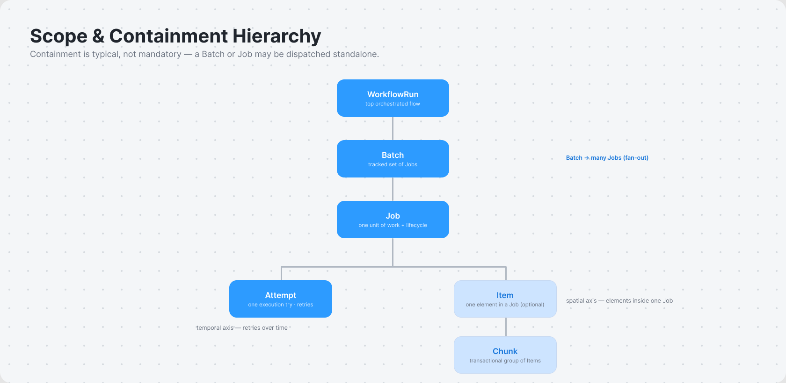

# Jobs System — Glossary & Naming Standard (Gold Standard)

**Status:** Normative. This is the single source of truth for terminology and naming across the Jobs System design. Every other document — `ARCHITECTURE.md`, `PROVIDER-REFERENCE.md`, `DATA-STRATEGY.md`, and all future specs — MUST comply.
**Rule of precedence:** if any document conflicts with this glossary, this glossary wins; fix the other document.
**Method:** each term was chosen for clarity and decisiveness, grounded in cross-system precedent (Appendix), not in whichever word a source happened to use. Convenience never beat clarity.
**Locale:** **en-US (American English)** is the single locale for this entire design — all prose, code, identifiers, state values, event names, and comments. British/Commonwealth spellings are non-compliant (see §1, Spelling & locale).

---

## 1. Naming Conventions (structural)

One rule per context. No exceptions outside the table.

| Context | Rule | Example |
|---|---|---|
| Type / entity / class names | **PascalCase, singular** | `Job`, `JobAttempt`, `WorkflowRun`, `DeadLetter`, `IdempotencyRecord` |
| Wire / JSON fields (inside `data`) | **camelCase** | `jobId`, `idempotencyKey`, `attemptCount`, `tenantId` |
| CloudEvents context attributes (envelope) | **lowercase, alphanumeric only, ≤20 chars** (spec-mandated) | `id`, `source`, `type`, `time`, `idempotencykey`, `traceparent`, `tenantid` |
| SQL tables & columns | **snake_case; table names singular** | table `job_attempt`; column `idempotency_key` |
| Enum / state / event-action **values** | **lowercase snake_case** | `succeeded`, `dead`, `timed_out`, `dead_lettered` |
| Primary identifier (within an entity) | bare **`id`** | a `Job` document's own key is `id` |
| Foreign reference | **`<entity>Id`** (wire) / **`<entity>_id`** (SQL) | `jobId` ↔ `job_id`, `workflowRunId` ↔ `workflow_run_id` |
| Timestamps | **`<verbed>At`** (wire) / **`<verbed>_at`** (SQL); value = **RFC 3339 / ISO 8601, UTC** | `createdAt`, `startedAt`, `finishedAt`, `scheduledAt` |
| Booleans | **`is` / `has` prefix** | `isTerminal`, `hasCompensation`, `isRetryable` |
| Collections / repeated fields | **plural** | `attempts`, `steps`, `compensations` |
| Abbreviations | **banned** except the allow-list: `id`, `DLQ`, `SQL`, `cron`, `UTC`, `p50/p95/p99`, `TTL`, `mTLS`, `OLAP` | spell out: `message` not `msg`, `execute` not `exec`, `config` not `cfg` |
| Spelling & locale | **en-US (American English)** everywhere — prose, code, identifiers, state values, comments | `canceled`/`canceling` (not `cancelled`/`cancelling`), `behavior`, `initialize`, `acknowledgment`, `color`, `catalog`, `analyze` |

**Why these:** CloudEvents *requires* lowercase envelope attributes; the `data` payload and control-plane API use camelCase (the dominant app-ecosystem convention). SQL uses snake_case (relational norm). Enum values are lowercase snake_case for wire-neutrality and to avoid AWS-style shouting (`SUCCEEDED`). See Appendix for the evidence behind each.

### 1.1 Event-type grammar

CloudEvents `type` attribute follows reverse-DNS, dotted, **past-tense**, singular entity:

```
<reverse-dns-namespace>.<entity>.<pastTenseAction>
```

Canonical examples: `io.jobs.job.succeeded`, `io.jobs.job.dead_lettered`, `io.jobs.workflow.started`, `io.jobs.batch.completed`, `io.jobs.attempt.failed`.

Internal (non-envelope) lifecycle event names drop the namespace: `job.succeeded`, `workflow.step_completed`. Always past-tense; the action value obeys the lowercase-snake_case enum rule.

---

## 2. Canonical Domain Terms

Each entry: **definition** + *rejected alternatives (why)*. Use the bold term everywhere; never the rejected ones.

### 2.0 Scope & containment hierarchy

Work is organized at nested scopes. Containment is *typical, not mandatory* — a `Batch` or `Job` may be dispatched standalone, without an enclosing `WorkflowRun`.



```
WorkflowRun            top-level orchestrated flow (multi-step, durable, crash-safe)
  └─ Step / Activity     a node in the flow; an Activity may dispatch ↓
Batch                  a tracked set of Jobs (horizontal grouping / fan-out)
  └─ Job               one unit of work (durable identity + lifecycle state, §3)
       ├─ Attempt        one execution try of the Job (N per Job, over time)
       └─ Item           one element processed within a single Job (N per Job)
            └─ Chunk      (optional) a transactional group of Items committed together
```

Three distinct "many" axes — never conflate them:
- **Batch → Jobs:** many independent *Jobs* grouped together (fan-out of units).
- **Job → Attempts:** *temporal* granularity — retries of the same Job over time.
- **Job → Items:** *spatial* granularity — elements processed inside one Job execution.

### 2.1 Lower tier — jobs & transport

- **Job** — a unit of work with durable identity and a single owning state (§3 states). The primary lower-tier noun. *Rejected: `task` (catastrophically overloaded — a unit of work in some systems, a workflow step in others); `message` (that is the wire envelope, not the work).*
- **JobType** — the registered kind of a job (its handler contract + payload schema). The definition; a `Job` is an instance of a `JobType`. *Rejected: `task type`, `job class`.*
- **Attempt** (`JobAttempt`) — one execution try of a `Job`. Append-only; the sequence of attempts IS the retry history. *Rejected: `execution` (reserved for workflow instances), `retry` (that is the event that causes the next attempt), `delivery` (transport-only).*
- **Worker** — a process that leases jobs and runs attempts. Scoped to the *process/role*, not a job class. *Rejected: `consumer` (transport-only framing); note Sidekiq bans "worker" for the job-class meaning — we never use it that way.*
- **Message** — the on-the-wire CloudEvents envelope carrying a job or event. Distinct from `Job` (the work) and `payload` (the `data` field). *Rejected: using `message` for the unit of work.*
- **Queue** — the lower-tier transport that holds messages awaiting lease. A port (see `ARCHITECTURE.md` §3). *Rejected: `broker` (the transport implementation, not the abstraction).*
- **Lease** — the period a claimed job is hidden from other workers, with a deadline a worker extends via **heartbeat**. *Rejected: `visibility timeout` (vendor term for the same thing), `lock` (overloaded), `ack deadline`, `reservation`.*
- **Ack / Nack** — acknowledge success (remove from queue) / negative-acknowledge failure (re-deliver). *Rejected: `complete`/`abandon`, `delete message` (adapter-level verbs).*
- **Batch** — a tracked set of jobs submitted and observed together, with a completion policy (all / any / threshold) and live counters. Groups many `Job`s (§2.0). *Rejected: `group`/`chord`/`chain` (specific Celery primitives), `flow` (BullMQ), `bulk` (an API-call style, not a tracked aggregate).*
- **Item** — one element processed *within* a single `Job`; a Job may process many Items (e.g. rows in a file, IDs in a list). Per-Item outcome is `succeeded` | `failed`, so a Job can **partially** succeed; partial-failure handling follows the failure taxonomy (`ARCHITECTURE.md` §12). The spatial granularity axis (§2.0). *Rejected: `task` (overloaded), `record` (too data-specific), `entry`/`element` (weaker precedent).*
- **Chunk** — an optional transactional group of `Item`s committed together within one `Job` (commit-interval / throughput control). *Rejected: `page`, `window`, `partition`.*

### 2.2 Upper tier — durable workflows

- **Workflow** — a multi-step, long-running, crash-safe process **definition**. The upper-tier process template. *Rejected as the entity noun: `orchestration` (kept ONLY as the name of the tier/capability — "durable orchestration tier" — never as the instance), `state machine`, `DAG` (vendor-flavored).*
- **WorkflowRun** — one running instance of a `Workflow`. Applies the general **definition↔instance rule: `<Noun>` = template, `<Noun>Run` = instance.** *Rejected: `workflow execution` (the word "execution" is overloaded with attempt-level execution).*
- **Step** — a single node within a `Workflow` (umbrella: an activity-step, timer-step, choice-step, or child-workflow-step). *Rejected: `task` (overloaded), `state` (Step-Functions-specific).*
- **Activity** — a **Step** that performs a side effect / calls out to do real work. The only place I/O is allowed inside the durable tier (workflow bodies must stay deterministic, §2.3). *Rejected: `action`, `operator`.*
- **Event History** — the append-only log of a `WorkflowRun` that enables crash recovery by replay; its source of truth. Each record is a **HistoryEvent**. *Rejected: `journal`, `event log`, `execution history`.*
- **Signal** — a message sent into a running `WorkflowRun` to influence it (write). **Query** — a read-only, side-effect-free view of a `WorkflowRun`. *Rejected: `external event` (vague).*
- **Timer** — a durable, replay-safe wait inside a `Workflow`. *Rejected: `wait state`, `sleep`.*
- **Child Workflow** — a `WorkflowRun` started by another `WorkflowRun`. *Rejected: `sub-orchestration`, `sub-workflow`.*
- **Compensation** — the action that undoes a completed saga `Step` when a later `Step` fails. *Rejected: `rollback` (implies DB transaction semantics), `undo`.*
- **Determinism / deterministic** — the property that workflow code produces identical decisions when replaying the same `Event History`. *Rejected: `replay-safe` as the primary term (acceptable as a descriptive synonym).*
- **Continue-As-New** — a workflow operation that ends the current `WorkflowRun` and starts a fresh one with the same workflow id and carried-forward state, truncating `Event History` to bound its growth for long-running or eternal workflows. In-flight steps are not auto-carried — drain or re-issue them. *Rejected: `restart` (implies losing state), `recycle`.*

### 2.3 Supporting & cross-cutting

- **IdempotencyRecord** — a stored `idempotencyKey` → first `jobId` + result reference + status (`in_progress` | `committed`); the dedup primitive that makes at-least-once delivery effectively-once. *Rejected: `dedup record`, `message log`.*
- **Outbox** — a table written in the **same transaction** as business state, later relayed to the `Queue` (atomic publish). An **OutboxEntry** is one pending message. *Rejected: `event queue table`.*
- **DeadLetter** — the record for a `Job` that exhausted retries or failed non-retryably, parked in the **Dead-Letter Queue (DLQ)** with original message + attempt history + last error. Verb: **dead-letter**. *Rejected: `DLX` (RabbitMQ-specific), `poison queue`.*
- **Schedule** — a recurring (cron) or future-dated trigger that emits jobs/workflows; each occurrence fires exactly once cluster-wide. *Rejected: `trigger`, `timer` (reserved for the durable-workflow wait), `cron job` as the noun (`cron` is only the expression grammar).*
- **Tenant** — an isolation scope (`tenantId`) constraining authorization and storage access. *Rejected: `org`, `account` (deployment-specific).*
- **LifecycleEvent** — an append-only record of a `Job`/`Batch` state transition (`fromState`, `toState`, reason, actor, `occurredAt`); feeds history and analytics. *Rejected: `state change`, `audit row`.*
- **Checkpoint** — a durable cursor for mid-`Job` resumption: the last committed `Chunk` (or `Item` index) plus an optional opaque payload, persisted to the `Store` and propagated over the lease heartbeat. On redelivery, a new `Attempt` resumes from the last Checkpoint instead of restarting the Job. Distinct from progress *reporting* (telemetry), which is never a resume point. *Rejected: `savepoint` (global-snapshot connotation), `offset` (stream-partition-specific), `bookmark`.*

### 2.4 Analytics

- **Rollup** — a precomputed, time-bucketed aggregate projection (throughput, success rate, latency buckets, queue-wait, DLQ growth) per `tenantId` × `jobType` × time bucket, built from `LifecycleEvent`s. *Rejected: `aggregate`, `summary table`.*
- **Export Feed** — the outbox/CDC stream of `LifecycleEvent`s shipped to an external OLAP store (star schema: `fact_job_execution` + dimensions). *Rejected: `analytics pipeline`.*

---

## 3. Canonical State & Event Vocabulary

### 3.1 Job states (the owning state of a `Job`)

`scheduled` → `queued` → `running` → (`retrying` ⇄ `running`) → `succeeded` | `dead` | `canceled`

| Value | Meaning |
|---|---|
| `scheduled` | Accepted; not yet eligible to run (future-dated or cron-pending). |
| `queued` | Eligible; waiting for a worker to lease. |
| `running` | Leased by a worker; an `Attempt` is executing. |
| `retrying` | Last `Attempt` failed retryably; waiting out backoff before re-queue. |
| `succeeded` | **Terminal.** Completed successfully. |
| `dead` | **Terminal.** Retries exhausted or non-retryable; parked in the DLQ. |
| `canceled` | **Terminal.** Canceled from any non-terminal state. |

*Rejected: `pending` (means "unknown/unsent" ambiguously), `waiting`, `enqueued` (→ use `queued`); `active`/`started`/`in_progress` (→ `running`); `done`/`completed`/`success` (→ `succeeded`, the unambiguous antonym of failure); `cancelled` (British), `aborted`/`revoked`/`terminated` (vendor-isms) (→ `canceled`).*

> Note: `failed` is **not** a resting job state. It is an **Attempt outcome** (§3.2). A job whose attempts are exhausted becomes `dead`.

### 3.2 Attempt outcomes (the result of one `JobAttempt`)

`succeeded` | `failed` — and on `failed`, a **failure class** (§ `ARCHITECTURE.md` §12): `transient` | `permanent` | `poison` | `partial` | `infrastructure`. A **timeout** is a failure cause, not a separate state.

### 3.3 WorkflowRun states

`running` → `succeeded` | `failed` | `timed_out` | `canceled`

Unlike jobs, a `WorkflowRun` does not dead-letter; a terminally failed run rests in `failed` with its `Event History` retained for audit.

---

## 4. Author Compliance Checklist

Before committing any design doc:

- [ ] Every entity uses a **§2** canonical term — no `task` for a unit of work, no `orchestration` for an instance, no `worker` for a job class.
- [ ] Every state value is from **§3** — no `done`, no `cancelled`, no `pending`.
- [ ] Casing matches **§1** per context (PascalCase types, camelCase wire, snake_case SQL, lowercase CloudEvents attrs, lowercase-snake enum values).
- [ ] Event types follow the **§1.1** grammar (reverse-DNS, past-tense).
- [ ] Timestamps are `<verbed>At` / `<verbed>_at`, RFC 3339 UTC.
- [ ] No banned abbreviations; **en-US** spelling throughout (no `cancelled`, `behaviour`, `colour`, `optimise`, …).
- [ ] Any new concept added here first, with a definition + rejected alternatives.

---

## Appendix — Cross-System Precedent (evidence)

Each decision traces to how mature systems name the concept. Sources are files under `docs/`; "—" = the system has no distinct term.

### Lower tier

| Concept | Celery | Sidekiq | BullMQ | SQS | Service Bus | Cloud Tasks | RabbitMQ | **Chosen** |
|---|---|---|---|---|---|---|---|---|
| Unit of work | task | job | job | message | message | task | message | **Job** |
| One try | retry/attempt | retry | attempt | delivery/attempt | delivery | attempt | delivery | **Attempt** |
| Runner process | worker | thread (bans "worker") | worker | consumer | consumer | worker/handler | consumer | **Worker** |
| Hide-while-processing | acks_late | — | lock | visibility timeout | lock duration | ack deadline | — | **Lease** |
| Dedup | idempotency | idempotency | deduplication | dedup id (FIFO) | message id | task dedup | message id | **idempotencyKey** |
| Failure sink | DLX | DLQ | failed | DLQ | DLQ | (none) | DLX | **DLQ** |
| Group | group/chord/chain | batch | flow | batch (op) | batch (op) | — | — | **Batch** |
| Ack | ack | implicit | markComplete | delete | complete/abandon | HTTP 2xx | ack/nack | **Ack/Nack** |

> Key ambiguity: **"task"** = unit of work in Celery/Cloud Tasks but a *workflow step* in Airflow/Step Functions. **"worker"** explicitly banned by Sidekiq for the class meaning. Both informed our choices.

> Sub-job granularity: **Item** and **Chunk** follow the Spring Batch chunk-oriented model (`Job → Step → Chunk → Item`) and Step Functions Map (processes "items"); SQS batches carry "entries". This precedent drove choosing `Item` over `element`/`entry`/`record`.

### Upper tier

| Concept | Temporal | Step Functions | Durable Functions | Airflow | GCP Workflows | **Chosen** |
|---|---|---|---|---|---|---|
| Multi-step process | Workflow | State Machine | Orchestration | DAG | Workflow | **Workflow** |
| Step within | Activity | State / Task state | Activity function | Task | Step | **Step** (+ **Activity** = side-effecting step) |
| Definition vs instance | Definition / Execution | Definition / Execution | function / instance | DAG / DAG Run | (conflated) | **`<Noun>` / `<Noun>Run`** |
| Replay log | Event History | — | Orchestration history | — | — | **Event History** |
| Msg in | Signal | — | External event | Trigger | callback | **Signal** |
| Wait | Timer | Wait state | Durable timer | sensor | poll | **Timer** |
| Nested | Child Workflow | nested states | Sub-orchestration | SubDAG (deprecated) | Child workflow | **Child Workflow** |
| Undo | (code pattern) | Catch/Fallback | (code pattern) | — | try/except | **Compensation** |

> "Workflow" leads (Temporal + GCP, colloquial elsewhere); "orchestration" demoted to the tier name. "Activity" kept as the precise side-effecting-step term (mirrors Step Functions "Task state").

### States & structure

| Topic | Evidence | **Chosen** |
|---|---|---|
| Success terminal | Airflow `success`, Celery `SUCCESS`, BullMQ `completed`, Step Functions `SUCCEEDED` | `succeeded` (unambiguous antonym of `failed`) |
| Cancel | Celery `REVOKED`, Step Functions `ABORTED`; mature systems avoid the word | `canceled` (American spelling, plain word) |
| Event `type` format | CloudEvents spec: reverse-DNS, past-tense (`com.example.object.deleted`) | `<reverse-dns>.<entity>.<pastTenseAction>` |
| Envelope attr casing | CloudEvents spec: lowercase, alnum, ≤20 chars | lowercase no-separator |
| Wire field casing | Step Functions, K8s API: camelCase | camelCase |
| Enum value casing | AWS/K8s `UPPER_SNAKE`; CloudEvents/BullMQ/Airflow lowercase | lowercase snake_case |
| Timestamps | CloudEvents `time`; K8s `creationTimestamp`/`startTime`/`completionTime`; all RFC 3339 | `<verbed>At`, RFC 3339 UTC |

Full agent evidence and file citations are preserved in the session record; corpus sources are mapped in `ARCHITECTURE.md` Appendix C and `PROVIDER-REFERENCE.md` §8.
